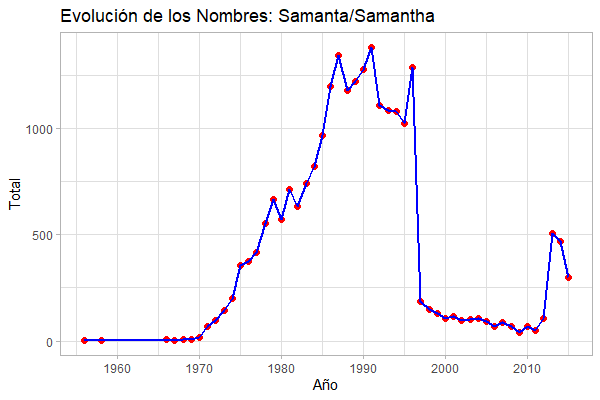

# Nombres_Argentina

El Gobierno de la Nación Argentina en su programa de datos Abiertos y mediante el Registro Nacional de las Personas hizo público hacia el año 2017 el siguiente sitio donde se puede ver qué tan popular fue tu nombre a lo largo de la historia. Es remarcable el trabajo de publicar una gran cantidad de datos, muchos de los cuales son anteriores a cualquier computadora y tuvieron que ser pasados a mano a partir de documentos en papel.

https://nombres.datos.gob.ar/

También hay un link al conjunto de datos con la que se alimenta la página

En la página
https://datos.gob.ar/dataset/otros-nombres-personas-fisicas

Directamente el Dataset
https://infra.datos.gob.ar/catalog/otros/dataset/2/distribution/2.1/download/historico-nombres.zip

Es un dataset de más de nueve millones de registro. No entra en un Excel, definitivamene. :smile:


## Problemas

Uno de los problemas es que la búsqueda que hace el sito es a nombre completo es decir, si uno busca "Juan" muestra la cantidad de personas que se inscribieron como "Juan" a secas. No cuentan los "Juan Carlos" ó los "Juan José"

Por ejemplo:

- Juan: 44756 personas desde 1922 a 2015
- Juan Carlos: 290266 personas en el mismo período
- Juan José: 95390 personas

También hay problemas con las búsquedas de algunos nombres como por ejemplo "D'angelo", que el buscador no permite buscarlo porque lo filtra con Javascript antes de hacer la consulta a la base de datos.

Durante el desarrollo de esto, aparecieron otros problemas que no son evidentes desde la aplicación web

- Registros que tienen comentarios, como por ejemplo "sale observado" ó "falta numeración"
- Datos traidos de sistemas con un código de página diferente (posiblente CP850) pero que se tradujeron directamente como code points de Unicode.
- Tildes invertidas como "Josè" ó "Agustìn"


## La motivación para hacer esto
Estoy aprendiendo R, y quería utilizar en dataset de alguna magnitud que tuviera algunos desafíos.

Finalmente, terminé utilizando otras herramientas más clásicas como sed and awk para hacerla manipulación inicial y limpieza de los datos.

Y... una v funcionando, es interesante ver cómo la tendencia de algunos nombres va reflejando los hechos de la Argentina.

Por ejemplo, abajo vemos la evolución del nombre "Samanta", un nombre que venía siendo popular hasta 1996 cuando cae abruptamente...para los más viejitos con memoria de lo que pasó en esa época.

También los picos de popularidad de Juan Domingo, Raúl Ricardo o Carlos Saúl en su momento y contrastando con eso, el poco impacto de los políticos en los nombres de recien nacidos después del año 2000.



## Uso.

Esto fue desarrolado con las utilidades de Ubuntu en Windows Subsystem for Linux. No está probad en ninguna otra distribución.

1) Clonar el repositorio (o bajarlo)
2) Bajar una copia del dataset del Gobierno y descomprimirla. No está en este repositorio. Es un archivo csv llamado "historico-nombres.csv"
3) Ejecutar

    ```` bash
    sed -f Sed_Script.txt historico-nombres.csv|awk -f Pre_awk.txt
    ````


Demora unos minutos. Son varias sustituciones con expresiones regulares sobre más de nueve millones de registros. Con esto se van a generar dos archivos. Uno llamado "Nombres-Limpio.csv" que tiene todos los nombres que se pudieron corregir con el script y otro llamado "Nombres-Problema.csv" que tiene 85 entradas que no se solucionaron y que hay que corregir a mano con un editor de texto.

4) Corregir a mano el archivo "Nombres-Problema.csv" y guardarlo como "Nombres-Problema-Corregido.csv". Luego volver a unir y limpiar. Hay una copia en este repositorio de los 85 nombres corregidos

    ```` bash
    cat Nombres-Problema-Corregido.csv >> Nombres-Limpio.csv && mv Nombres-Limpio.csv Nombres.csv && rm Nombres-Problema.csv
    ````


5) Generar los archivos finales y limpiar.

    ````
    awk -f Post_awk.txt Nombres.csv && rm Nombres.csv
    ````

Con esto ya estamos en condiciones de importar los datos a R y comenzar a hacer algunas cosas. En el archivo "Nombres.r" hay varios ejemplos de uso.


# Cómo sigue

Mi objetivo final es hacer una aplicación Shiny donde puedan poner el nombre de sus compañeros de escuela y les diga qué probabilidad hay que sean de una determinada clase (Julio de un año hasta Junio del siguiente) usando aguna inferencia Bayesiana. Contribuciones y ayuda, más que bienvenidas.

Esto es libre para usarlo como quieran, el único pedido es que si lo úsan me den crédito donde lo usen.

Por comentarios, sugerencias o lo que sea. Por aquí, o por pm en Reddit al usuario u/CalmRott7915

