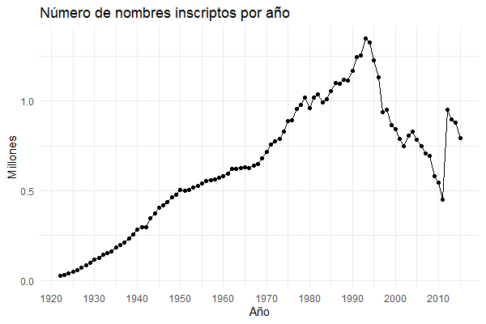
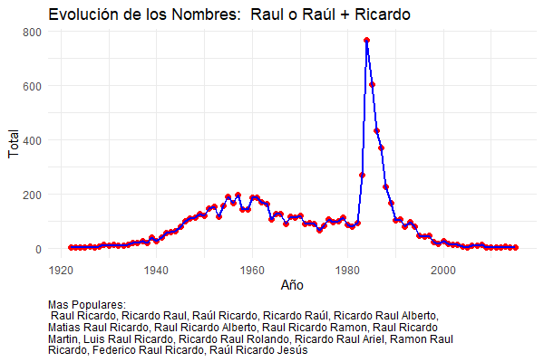
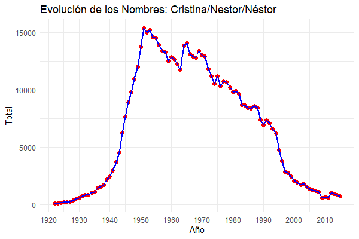

# Nombres_Argentina

El Gobierno de la Nación Argentina en su programa de Datos Abiertos y mediante el Registro Nacional de las Personas hizo público hacia el año 2017 el siguiente sitio donde se puede ver qué tan popular fue tu nombre a lo largo de la historia. Es remarcable el trabajo de publicar una gran cantidad de datos, muchos de los cuales son anteriores a cualquier computadora y tuvieron que ser pasados a mano a partir de documentos en papel.

https://nombres.datos.gob.ar/

También hay un link al conjunto de datos con la que se alimenta la página

En la página
https://datos.gob.ar/dataset/otros-nombres-personas-fisicas

Directamente el Dataset
https://infra.datos.gob.ar/catalog/otros/dataset/2/distribution/2.1/download/historico-nombres.zip

Es un dataset de más de nueve millones de registro. No entra en un Excel, definitivamene. :smile:


## Uso.

Ésto fue desarrolado con las utilidades de Ubuntu en Windows Subsystem for Linux. No están probados en ninguna otra distribución.

1) Clonar el repositorio (o bajarlo)
2) Bajar una copia del dataset del sitio del Gobierno y descomprimirla. Es un archivo csv llamado "historico-nombres.csv"
3) Ejecutar:

    ```` bash
    sed -f Sed_Script.txt historico-nombres.csv|awk -f Pre_awk.txt
    ````

Demora unos minutos. Son varias sustituciones con expresiones regulares sobre más de nueve millones de registros. Con esto se van a generar dos archivos. Uno llamado "Nombres-Limpio.csv" que tiene todos los nombres que se pudieron corregir con el script y otro llamado "Nombres-Problema.csv" que tiene 85 entradas que no se solucionaron y que hay que corregir a mano con un editor de texto.

4) Corregir a mano el archivo "Nombres-Problema.csv" y guardarlo como "Nombres-Problema-Corregido.csv". Luego volver a unir y limpiar. Hay una copia en este repositorio de los 85 nombres corregidos.

    ```` bash
    cat Nombres-Problema-Corregido.csv >> Nombres-Limpio.csv && mv Nombres-Limpio.csv Nombres.csv && rm Nombres-Problema.csv
    ````


5) Generar los archivos finales y limpiar.

    ````
    awk -f Post_awk.txt Nombres.csv && rm Nombres.csv
    ````

Ya estamos en condiciones de importar los datos a R y comenzar a hacer algunas cosas. En el archivo "Nombres.r" hay varios ejemplos de uso.


## Problemas del Sitio y los Datos

Uno de los problemas del sitio del Gobierno es que la búsqueda es de nombres completos es decir, si uno busca "Juán" muestra la cantidad de personas que se inscribieron como "Juán" a secas. No cuentan los "Juán Carlos" ó los "Juán José". Se ve que:

- Juán: 44756 personas desde 1922 a 2015
- Juán Carlos: 290266 personas en el mismo período
- Juán José: 95390 personas

También hay problemas con las búsquedas de algunos nombres como por ejemplo "D'angelo". Existen en los datos originales, pero la página filtra con Javascript todo lo no alfabético antes de hacer la consulta a la base de datos.

Durante el desarrollo, aparecieron otros problemas que no son evidentes desde la aplicación web:

- Registros que tienen comentarios, como por ejemplo "sale observado" ó "falta numeración"
- Datos traidos de sistemas con codificación diferente (posiblente CP850) pero que se tradujeron directamente como code points de Unicode.
- Tildes invertidas como "Josè" ó "Agustìn". Posiblemente de un teclado configurado para español de España.
- Hay alguna evidencia de que hay datos duplicados e inconsistencias año a año. Esto no es posible de resolver sin saber cuales fueron las fuentes de datos originales utilizadas en el dataset. Hay que tener precaución al hacer comparaciones entre años. La evolucion del total de nombres inscriptos no es compatible con la evolución de la natalidad en Argentina (ver gráfico), y además existen entradas como por ejemplo "Jonathan Ogheneochuko Chukwuza Ekpelem Nkemcho" en 2005 que aparecen 4 veces. Si bien es posible, es improbable que 4 familias nigerianas hayan tenido un nacimiento de un varón en 2005 y las cuatro familia hayan decidido ponerle exactamente ese nombre.





## La motivación para hacer esto

Ya pasé de lo básico de R, y buscaba utilizar un dataset de alguna magnitud que tuviera algunos desafíos. Y éste vino muy bien. Hacer que ande a una velocidad razonable con 9 millones de registros llevó varias iteraciones. Desde R base, pasando por tidyverse para terminar decandando por data.table. De tenerlo una noche completa sin que termine de procesar, a poder hacerlo en pocos segundos


Y... una vez que está funcionando, es interesante ver cómo la tendencia de algunos nombres va reflejando los hechos de la Argentina.

Por ejemplo, abajo está la evolución del nombre "Samanta", un nombre que fue popular hasta 1996 cuando cae abruptamente...para los más viejitos con memoria de lo que pasó en esa época.

También son muy notables los picos de popularidad de Juan Domingo, Raúl Ricardo o Carlos Saúl y, contrastando con eso, el poco impacto de los políticos en los nombres de recien nacidos después del año 2000.







# Cómo sigue

El objetivo final es  una aplicación Shiny donde se pueda poner el nombre de sus compañeros de escuela y les diga qué probabilidad hay que sean de una determinada clase (Julio de un año hasta Junio del siguiente) usando inferencia Bayesiana.

Contribuciones, ayudas, ideas y sugerencias para mejorar el código, etc, más que bienvenidas.

Es libre para usarlo como quieran, el único pedido es que si lo usan mantengan los créditos.

Por comentarios, sugerencias o lo que sea. Por aquí, o por pm en Reddit al usuario u/CalmRott7915
